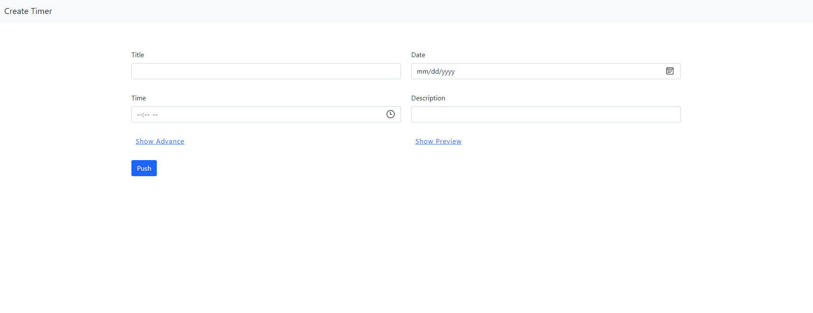
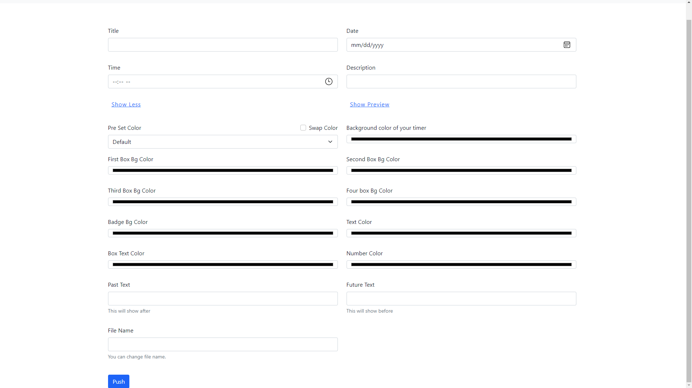

# Create Timer

### <a href="https://avinashboy.github.io/create-timer/">LIVE DEMO</a>

### *Note*: It will collect some information from you. After pressing the push button it will generate a new file. Now you can customise timer.

## Screenshots:

_This is creator page_

_More options_

